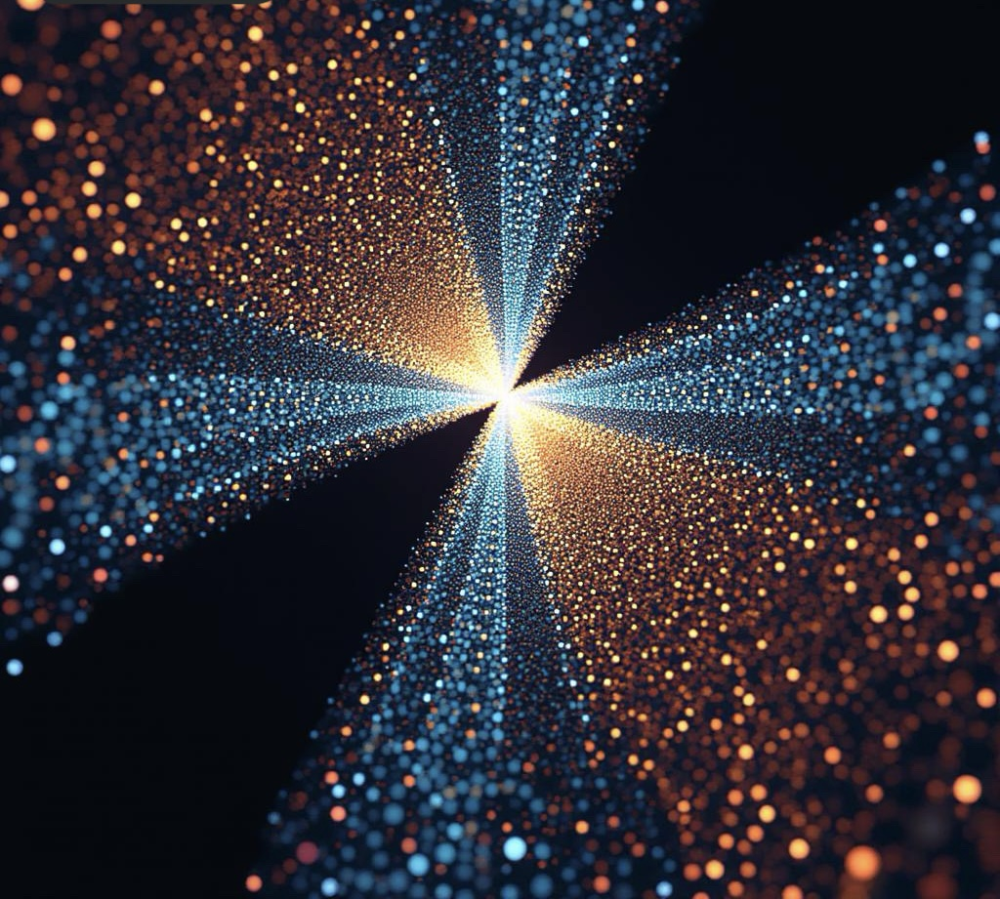

# **Compressive Framework (CF-DPF)**  
### *Dynamic Particle Formation from Wave Compression and Quantum Coalescence*

---

## 🌌 Overview

The **Compressive Framework (CF-DPF)** proposes a unified model of wave dynamics, chronon behavior, and quantum structure formation — demonstrating how **compression and interference** at the subquantum level lead to **particle creation and spacetime curvature**.

This project integrates:
- **Wave Compression & Energy Densification**
- **Temporal Quantization (Chronon Field Dynamics)**
- **Fractional Presence & Nonlocal Binding**
- **Particle Coalescence & Domain Formation**

All components are visualized and validated through **interactive Jupyter/MkDocs notebooks**, making the framework both rigorous and accessible.

---

## 📘 Notebook Collection

> *Explore each phase of the compressive model:*

1. [Wave Compression](notebooks/01_wave_compression.md)
2. [Chronon Dynamics](notebooks/02_chronon_dynamics.md)
3. [Particle Formation](notebooks/03_particle_formation.md)
4. [Wave → Particle Motion](notebooks/04_wave_to_particle_motion.md)
5. [Fractional Presence & Nonlocal Binding](notebooks/05_fractional_presence.md)
6. [Multi-Particle Coalescence](notebooks/06_particle_coalescence.md)
7. [Field Interactions](notebooks/07_field_interactions.md)
8. [Quantized Curvature](notebooks/08_quantized_curvature.md)
9. [Vacuum Symmetry Breaking](notebooks/09_vacuum_symmetry_breaking.md)
10. [Vacuum Domain Formation](notebooks/10_vacuum_domain_formation.md)

---

## 🔬 Scientific Vision

> *From compression to creation — a continuous field model of matter.*

CF-DPF redefines how quantum matter emerges from distributed wave behavior, exploring:
- The **conversion of wave amplitude to localized curvature**
- The **propagation of temporal quanta (chronons, cognons, gravitons)**
- The **self-stabilization of energy through coalescent feedback**
- The **transition between nonlocal wave states and localized particles**

---

## 🧩 Structure of the Framework

    A[Distributed Field ψ(t,x)] -->B[Compression Nodes]
    B --> C[Resonant Interference]
    C --> D[Localized Energy Wells]
    D --> E[Particle Nucleation]
    E --> F[Wave-Particle Oscillation]
    F --> G[Multi-Particle Coalescence]
    G --> H[Curvature and Domain           Formation]

⸻

🤝 Contributing

Contributions and theoretical discussions are encouraged!
Please review the Contributing Guide and open issues or pull requests to extend or refine the framework.

© 2025 Compressive Framework — Dynamic Particle Formation (CF-DPF)
Built with ❤️ using MkDocs Material

