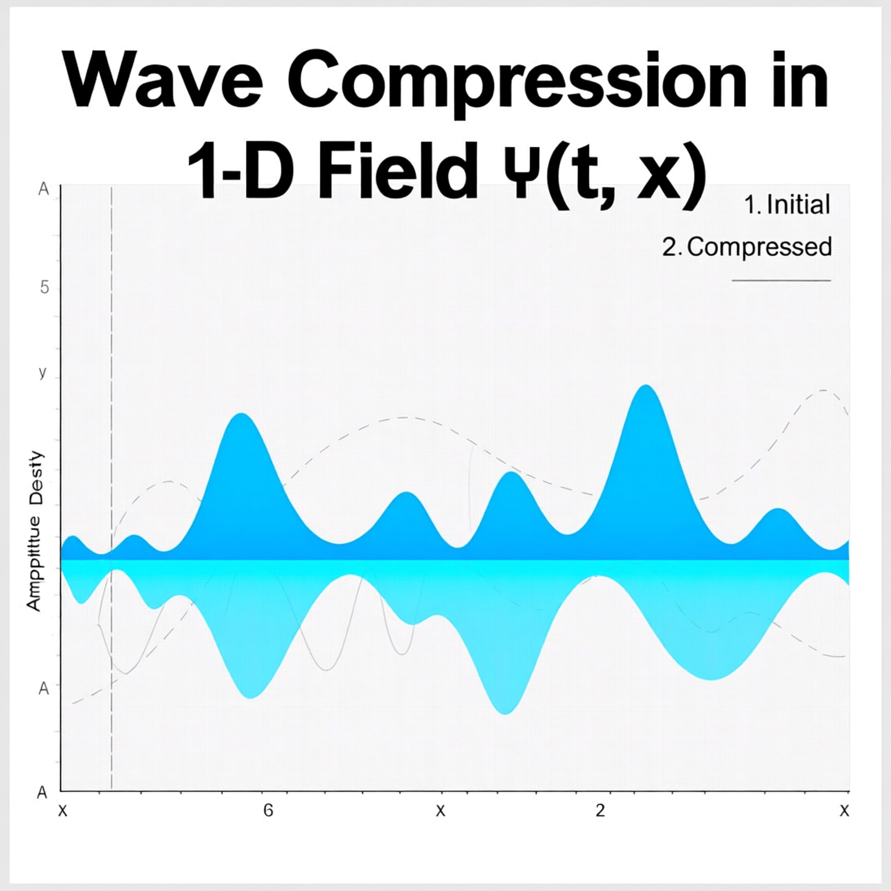
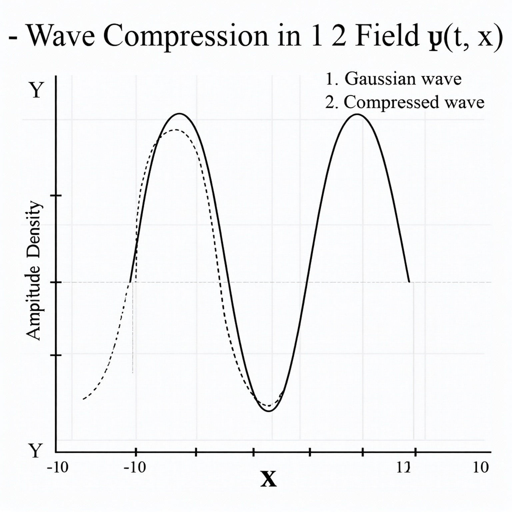

# 🌀 Wave Compression — Foundations of the Compressive Framework

> **Notebook 1 of 10**  
> Establishing the fundamental **wave compression dynamics** that give rise to all emergent particle behavior in the Compressive Framework (CF).

---

## 1. Concept Overview

The **Compressive Framework (CF)** begins with the **wavefunction ψ(t, x)**, which represents distributed presence — energy, probability, and informational amplitude.

Compression occurs when ψ(t, x) interacts with **spatial curvature** and **internal feedback** fields, gradually reducing its spread while amplifying local density.

This dynamic sets the foundation for particle formation and the coupling of **graviton**, **chronon**, and **cognon** modes.

---

## 2. Foundational Equation

The compressive wave equation can be written as a modified Schrödinger form:

\[
i \hbar \frac{\partial \psi}{\partial t} =
-\frac{\hbar^2}{2m} \nabla^2 \psi
+ \alpha |\psi|^2 \psi
- \beta \nabla^2(|\psi|^2)\psi
\]

where:

| Symbol | Meaning |
|:--------|:--------|
| \( \alpha \) | Nonlinear self-attraction (compression gain) |
| \( \beta \) | Diffusion-like resistance term |
| \( \psi(t,x) \) | Distributed wave amplitude |
| \( m \) | Effective inertial parameter |
| \( \hbar \) | Reduced Planck constant (scaling factor) |

This model balances **nonlinear focusing** with **spatial diffusion**, naturally producing compression thresholds that seed particle-like stability.

---

## 3. Visualization — 1D Wave Compression

⸻

4. Interpretation

As ψ compresses, three key subfields begin to emerge:
	•	Φ(t,x) → Graviton field (spatial curvature)
	•	χ(t,x) → Chronon field (temporal coherence)
	•	C(t,x) → Cognon field (informational density)

In subsequent notebooks, we’ll separately derive and visualize each of these, showing how they interact to create stable particle emergence and nonlocal coupling.

⸻

5. Next Notebook

Next: Chronon Dynamics →

We’ll explore temporal coherence, where ψ’s internal phase synchronization gives rise to the chronon field χ(t,x) — the heartbeat of compressed temporal structure.
