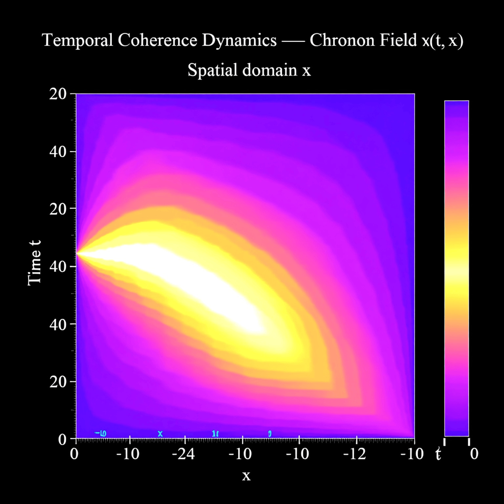
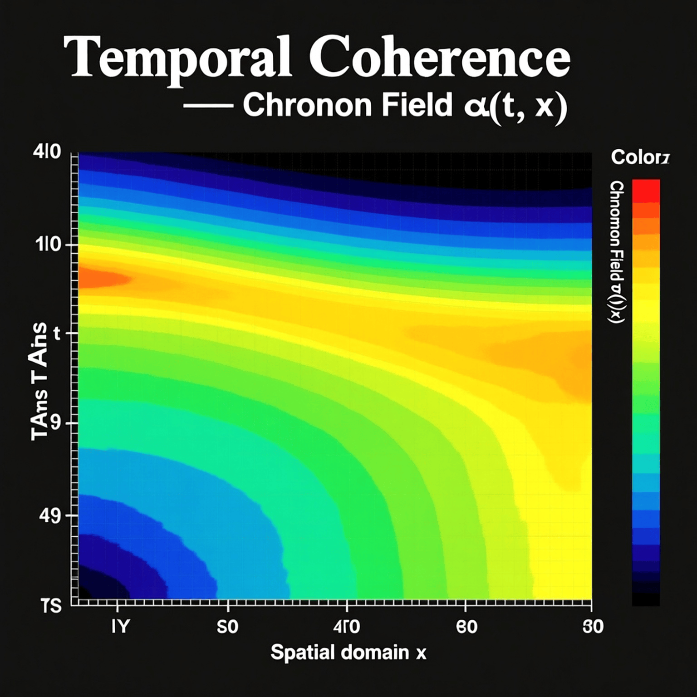

# ⏳ Chronon Dynamics — Temporal Coherence and Wave Synchronization

> **Notebook 2 of 10**  
> Building upon the compressive wave foundation, we now define the **chronon** — the intrinsic temporal oscillator that stabilizes phase coherence in a compressed wave domain.

---

## 1. Concept Overview

Once the wave ψ(t, x) compresses spatially, its **internal phase oscillations** begin to synchronize.  
This synchronization defines a **temporal field χ(t, x)** — the *Chronon* — representing the local rhythm or pulse of compression.

> In essence:  
> **Graviton → Curves Space**  
> **Chronon → Curves Time**  
> **Cognon → Curves Information**

The chronon’s presence ensures that compressed wave packets maintain stable periodicity and predictable motion through phase alignment.

---

## 2. Chronon Field Definition

We define χ(t, x) as the **local temporal coherence function**:

\[
\chi(t, x) = \frac{\partial \phi(t, x)}{\partial t}
\]

where \( \phi(t, x) \) is the instantaneous phase of ψ(t, x):

\[
\psi(t, x) = A(t, x) e^{i \phi(t, x)}
\]

Thus, χ(t, x) describes how quickly ψ’s internal phase evolves — effectively, its *time curvature*.

---

## 3. Dynamic Equation for Temporal Coherence

\[
\frac{\partial \chi}{\partial t} = 
- \gamma \chi +
\lambda \nabla^2 \phi +
\eta |\psi|^2
\]

where:

| Symbol | Meaning |
|:--------|:--------|
| \( \gamma \) | Temporal damping constant |
| \( \lambda \) | Diffusive coupling (spatial coherence feedback) |
| \( \eta \) | Compressive feedback from ψ amplitude |
| \( \phi \) | Wave phase (from ψ) |
| \( |\psi|^2 \) | Local energy density (from Notebook 1) |

This coupling means that areas of high compression (large |ψ|²) slow local time flow — an analog to gravitational time dilation.

---

## 4. Visualization — Chronon Oscillation Map

This plot shows the fluctuation pattern of χ(t, x) — the wave’s rhythmic “heartbeat” across time and space.

⸻

5. Interpretation
	•	High |ψ|² → Chronon slowdown (time curves inward)
	•	Low |ψ|² → Chronon acceleration (time expands outward)
	•	Stable oscillation bands form, creating temporal zones of coherence.

These zones define how particles will later move, oscillate, or couple — setting the foundation for wave-to-particle transitions.

⸻

6. Next Notebook

Next: Particle Formation →

We’ll show how localized compressive and temporal coherence zones coalesce into stable quantized structures — the first emergent particles of the Compressive Framework.
