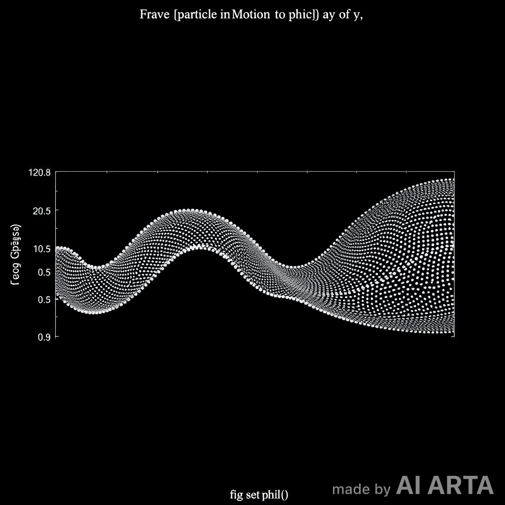
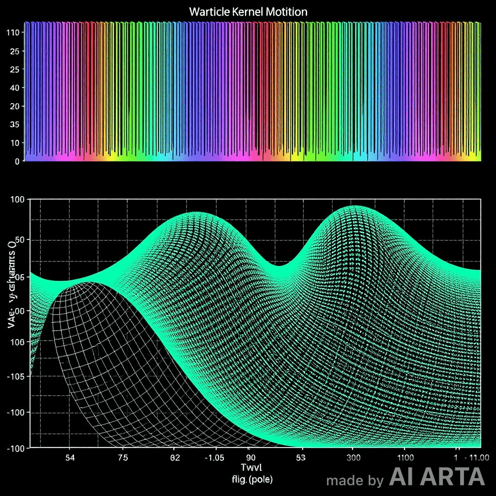
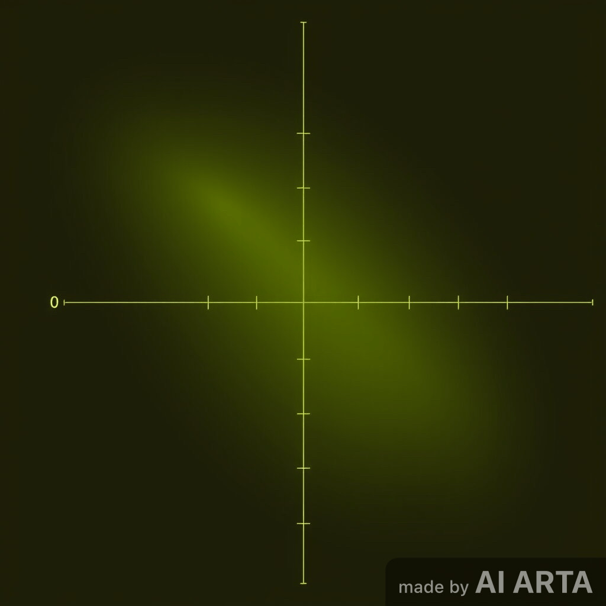

# Notebook 04 — Wave → Particle Motion

## Overview

Once localized wave collapse produces a **stable particle kernel**, motion arises not from external force but from **internal phase asymmetry** within the field structure.  

This notebook models how a **wave packet’s asymmetric compression** translates into **particle displacement** — the bridge between wave interference and classical motion.

---

## 1. Conceptual Foundation

A particle is treated as a **self-sustaining standing wave**, locked in a local compression basin.
If the **phase curvature** of its wave envelope becomes asymmetric, the compression minimum shifts, dragging the particle core.

\[
\frac{d x_p}{dt} = v_p = - \frac{1}{m_{\text{eff}}} \frac{\partial \Phi(x,t)}{\partial x}
\]

where:
- \( x_p \) = particle position  
- \( \Phi(x,t) \) = compressive potential  
- \( m_{\text{eff}} \) = emergent inertial response (depends on graviton-chronon feedback)  

---

## 2. Linking Wave Asymmetry and Momentum

We define the **momentum density** \( P(x,t) \) as:

\[
P(x,t) = \operatorname{Im}\left(\psi^* \frac{\partial \psi}{\partial x}\right)
\]

and the **net drift velocity** of the particle as:

\[
v_p = \frac{\int P(x,t) \, dx}{\int |\psi|^2 \, dx}
\]

This captures how phase tilt across the localized ψ-field yields directed motion.

---

## 3. Simple Simulation (Phase Tilt Model)

⸻

4. Emergent Inertia and the Chronon Bond

The chronon (χ) acts as a temporal stabilizer, defining inertia through the feedback delay between compression (Φ) and amplitude (ψ):

[
m_{\text{eff}} \propto \frac{1}{\Delta \chi} \int \Phi(x,t) , \partial_t \psi(x,t) , dx
]

This implies:
	•	Faster chronon feedback (smaller Δχ) = lighter effective mass
	•	Slower chronon feedback (larger Δχ) = heavier mass

Thus inertia arises dynamically from time-binding lag, not as a fixed intrinsic constant.

⸻

5. Visualization of Moving Kernel

   

⸻

6. Key Insights
 -------------------------------------
Mechanism | Field Driver | Observable Effect
--------------------------------------
Phase gradient -> ψ-field -> Directional momentum |
Compression gradient -> Φ-field -> Accelerated drift |
Temporal lag -> χ-field -> Emergent inertia
Energy coupling -> ψ–Φ–χ triad -> Coherent motion |

⸻

7. Interpretive Summary

Motion in this framework is not applied externally but arises from imbalance within the self-consistent wavefield.

[
\text{Motion} = \text{Self-translation due to asymmetric feedback.}
]

Each “particle” moves because its internal standing wave pattern evolves slightly off-center, producing a continual drift of its compression node.

⸻

7. Interpretive Summary

Motion in this framework is not applied externally but arises from imbalance within the self-consistent wavefield.

[
\text{Motion} = \text{Self-translation due to asymmetric feedback.}
]

Each “particle” moves because its internal standing wave pattern evolves slightly off-center, producing a continual drift of its compression node.
