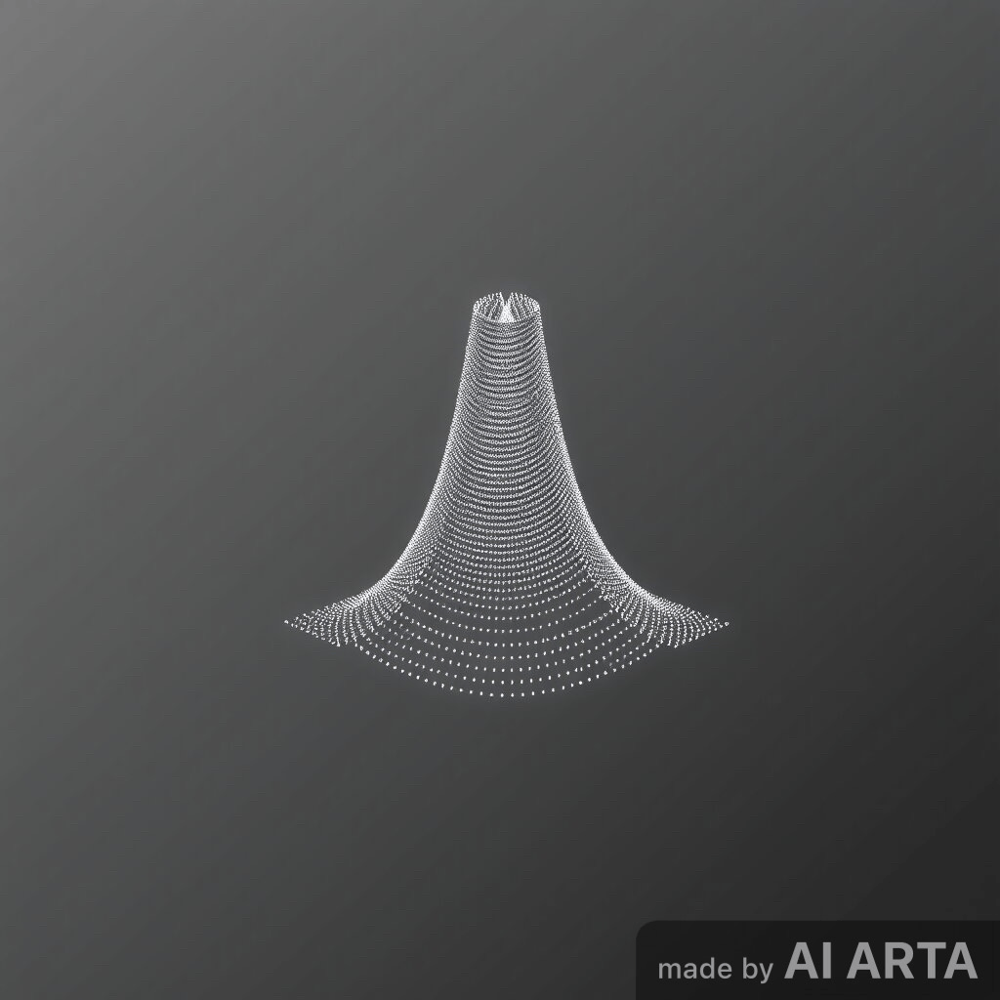
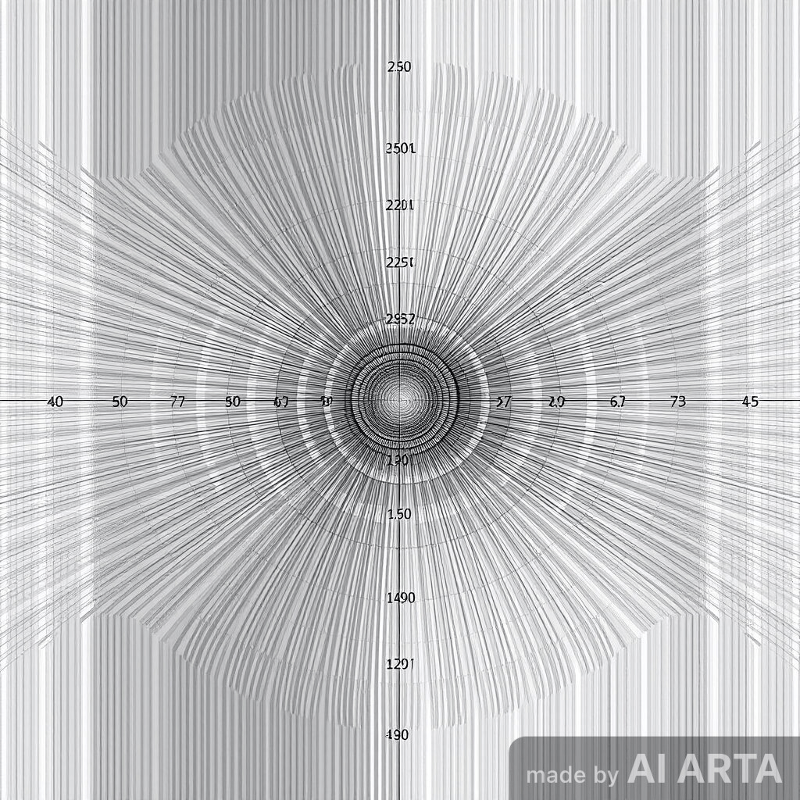
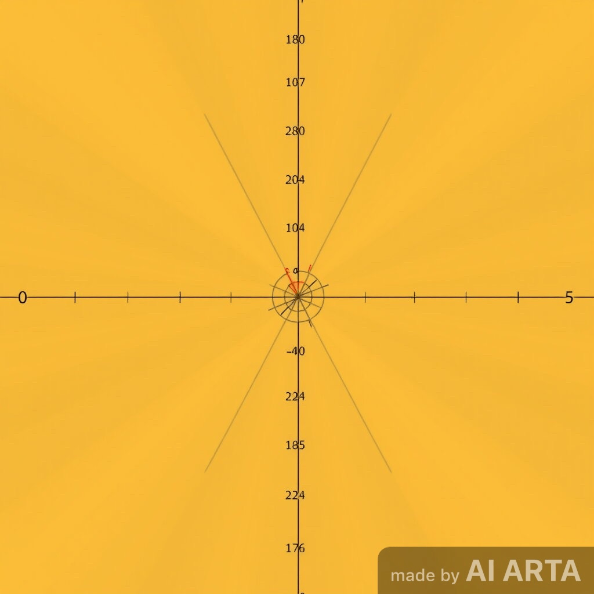
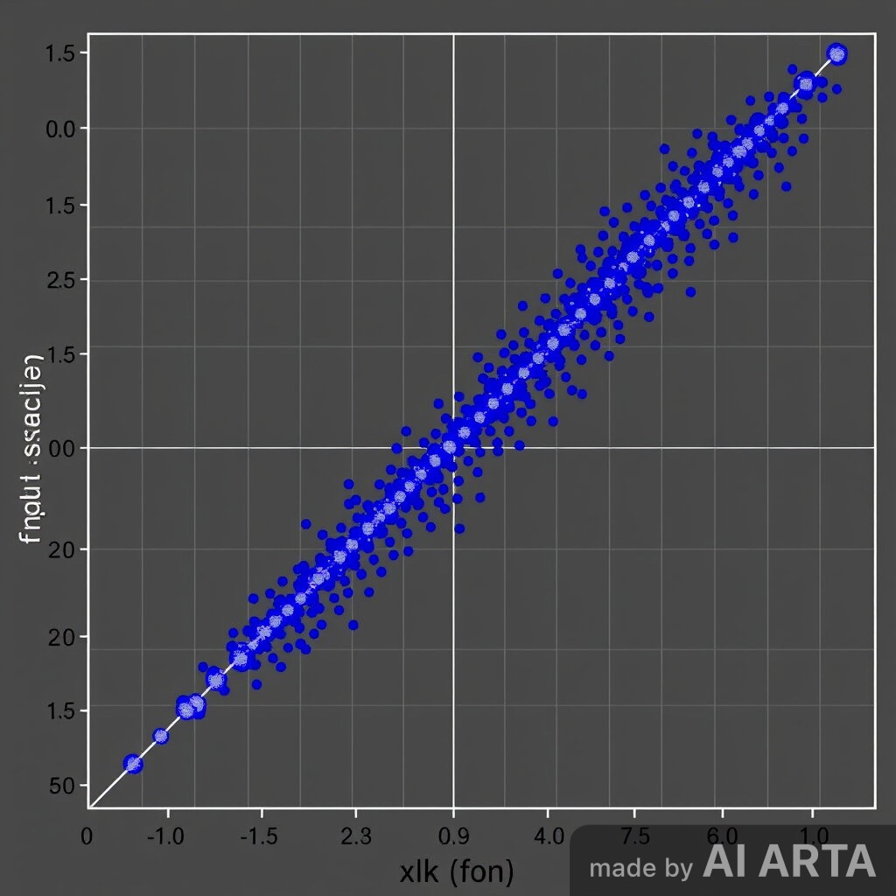
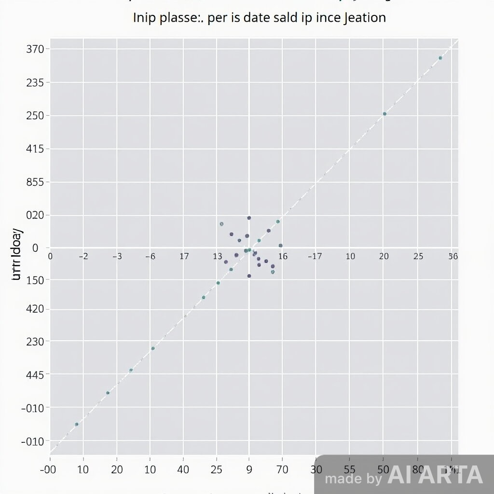
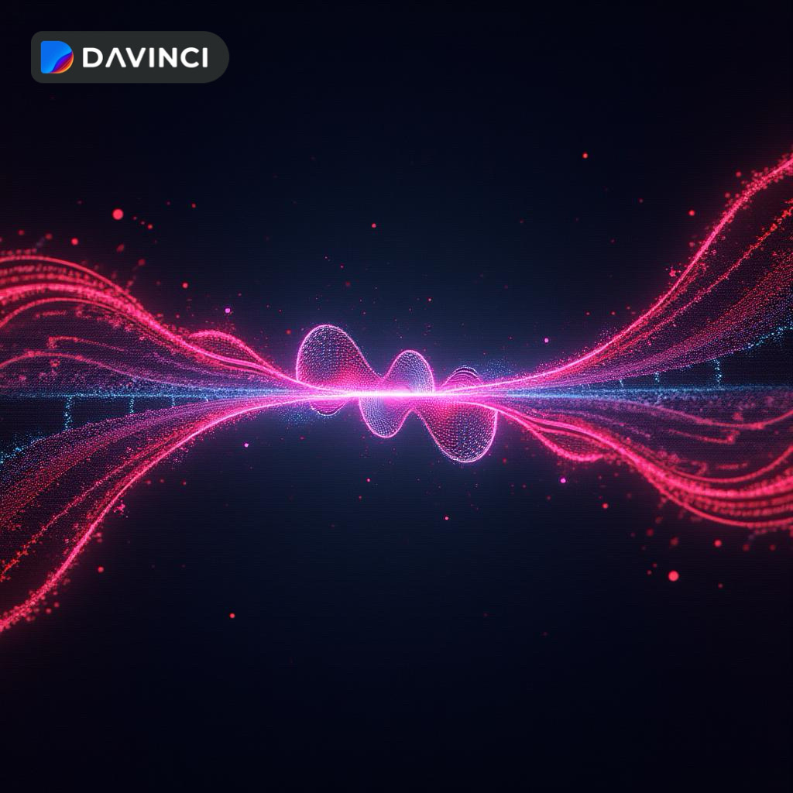

# Notebook 05 — Fractional Presence & Nonlocal Binding

## Overview

After wave–particle transition, the system exhibits **fractional presence** — a particle’s field is not fully localized but distributed across several *compression basins*.  
This fractional distribution enables **nonlocal binding**: distant regions of the ψ-field remain **phase-locked** through the shared chronon–graviton (χ–γ) background.

---

## 1. Conceptual Foundation

We redefine the particle’s probability amplitude as a **distributed state**:

\[
\Psi(x,t) = \sum_i a_i \psi_i(x - x_i, t)
\]

where each component \( \psi_i \) represents a **fractional localization** (presence node), and:

\[
\sum_i |a_i|^2 = 1
\]

The physical interpretation:
- The particle is **not fragmented**, but **coherently multi-local**.
- Fractional nodes share phase via **nonlocal entanglement** maintained by chronon synchronization.

---

## 2. Phase-Coherent Fractional States

This visualization shows coherent interference between distributed nodes — a continuous ψ-field maintains unity across separated basins.

⸻

3. Chronon Synchronization (Temporal Binding)

Fractional nodes maintain coherence through chronon feedback coupling:

[
\chi_i(t + \Delta t) = \chi_j(t) + \Delta \tau_{ij}
]

[
\Delta \tau_{ij} \to 0 \quad \Rightarrow \quad \text{phase locking}
]

The smaller the temporal drift ( \Delta \tau_{ij} ), the stronger the binding between distant nodes.

⸻

4. Nonlocal Correlation Model

Define correlation function ( C_{ij} ):

[
C_{ij} = \frac{\langle \psi_i^* \psi_j \rangle}{\sqrt{\langle |\psi_i|^2 \rangle \langle |\psi_j|^2 \rangle}}
]

If ( |C_{ij}| \approx 1 ), the nodes behave as one coherent entity — even when spatially distant.

⸻

5. Simple Correlation Simulation

from itertools import combinations

nodes = [np.exp(-((x - c)**2)/(2*sigma**2)) for c in centers]

def correlation(a, b):
    return np.sum(a * b) / np.sqrt(np.sum(a**2) * np.sum(b**2))

pairs = list(combinations(range(len(nodes)), 2))
corrs = [correlation(nodes[i], nodes[j]) for i, j in pairs]

for (i, j), c in zip(pairs, corrs):
    print(f"Correlation between node {i} and {j}: {c:.3f}")

This model numerically checks the binding coherence across the distributed ψ-field.

⸻

6. Visualization of Phase-Linked Nodes

⸻

7. Interpretation

Concept -> Description -> Physical Effect
-------------------------------

Distributed ->  ψ amplitude -> Multi-local identity

Chronon synchronization -> Temporal alignment -> Maintains coherence

Nonlocal correlation -> Shared phase structure -> Enables entanglement-like linkage

Graviton coupling -> Background curvature field -> Global stability

⸻

8. Summary

Fractional presence illustrates how one particle can be simultaneously multiple yet unified — coherence held by the χ–γ temporal–gravitational web.

In this model, entanglement is not a mystery but an expression of temporal co-binding within a continuous medium.

[
\text{Nonlocality} = \text{Synchronization across fractional time loops.}
]

⸻

Next Notebook → Multi-Particle Coalescence
