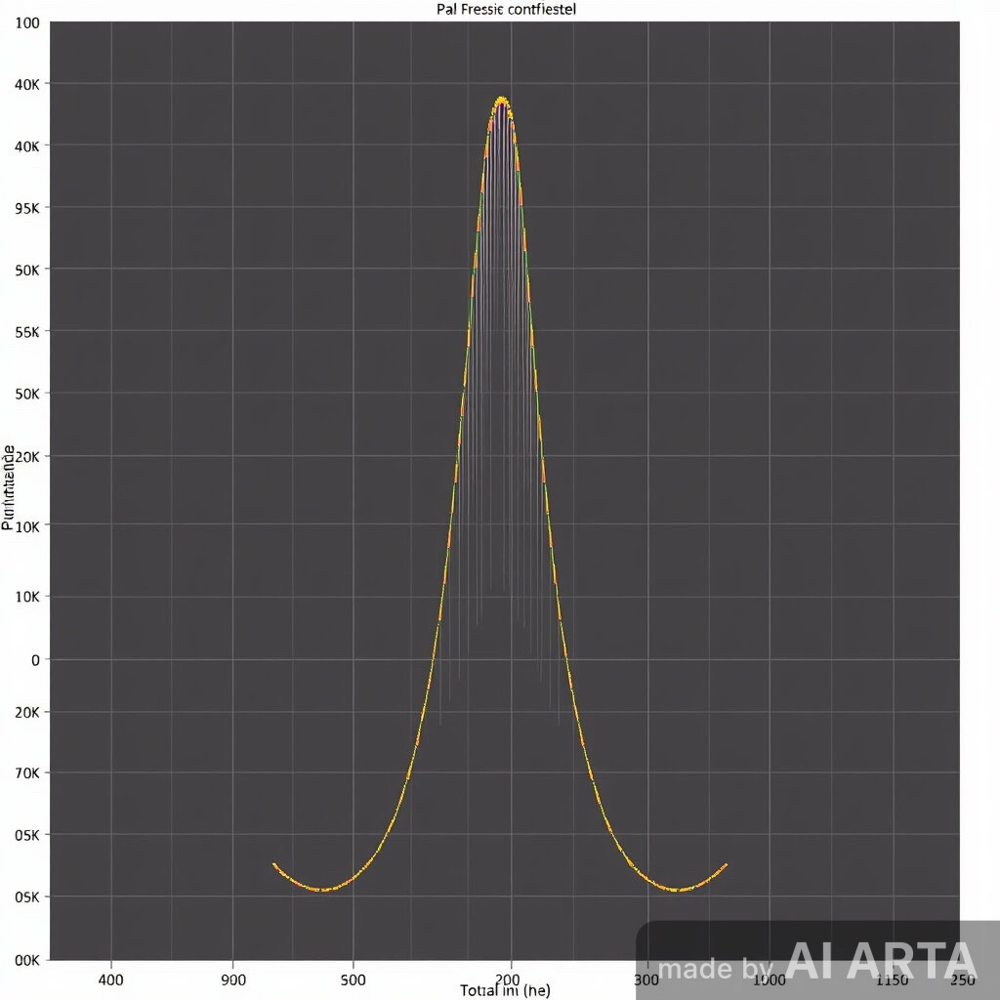
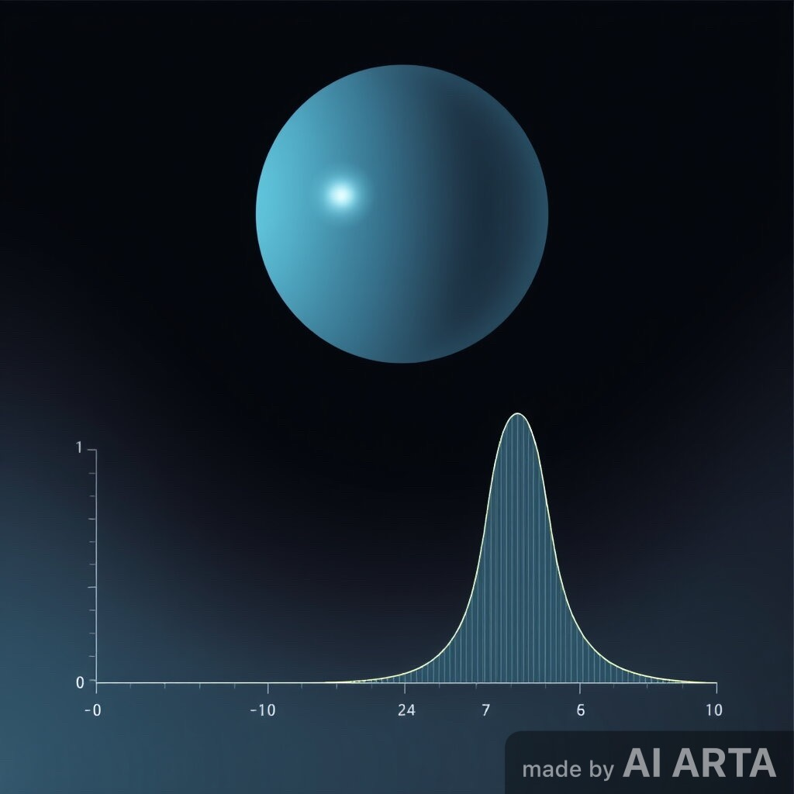
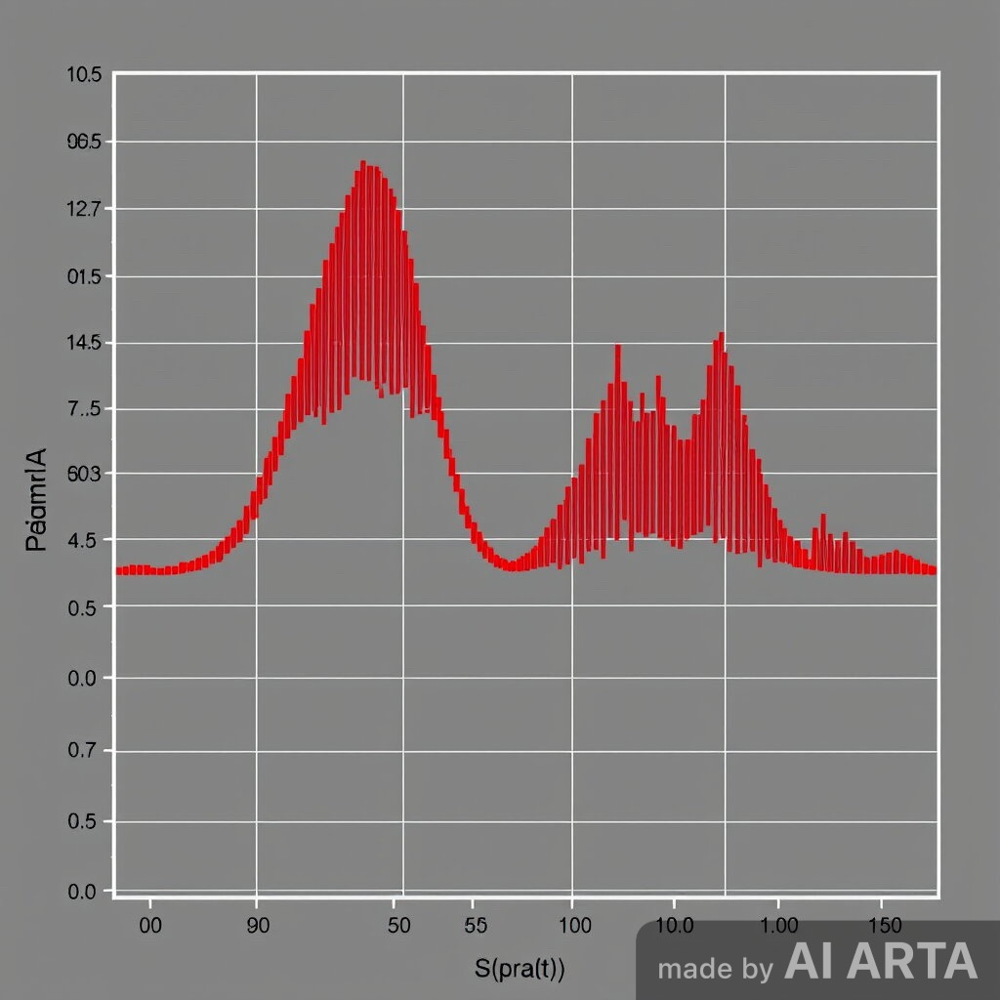
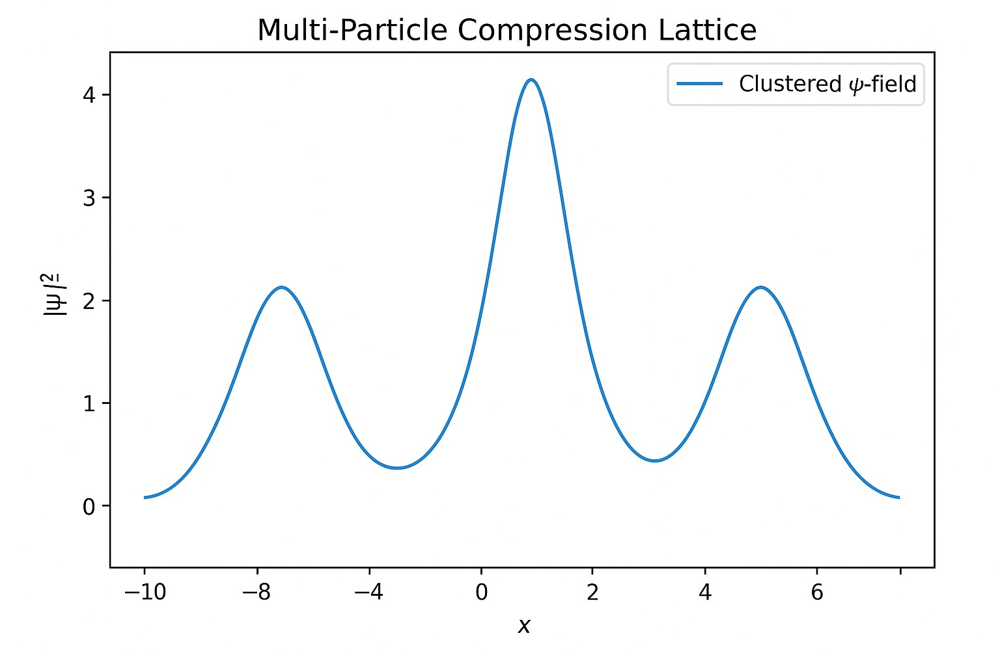
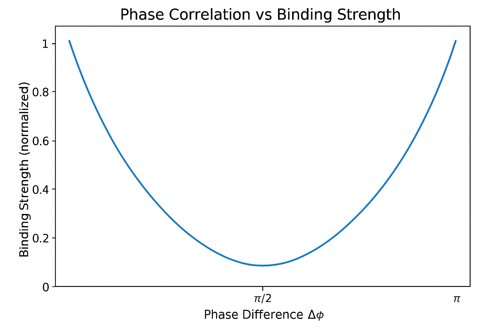

# Notebook 06 — Multi-Particle Coalescence

## Overview

Following **Fractional Presence & Nonlocal Binding**, we now explore how multiple coherent ψ-fields (particles) **merge into composite formations** through **synchronized compression** and **field phase alignment**.

This mechanism represents the **coalescence stage** of the Compressive Framework — where distributed entities form unified systems without loss of individuality, stabilized by **graviton–chronon coupling**.

---

## 1. Foundational Concept

When two or more particles with overlapping wave compression fields approach,
their **probability amplitudes** combine:

\[
\Psi_{\text{total}} = \sum_{i=1}^N \alpha_i \Psi_i(x, t)
\]

Under **phase resonance**:
\[
\phi_i - \phi_j \to 0 \quad \Rightarrow \quad \text{Constructive compression → Bound state}
\]

and under **anti-phase** conditions:
\[
\phi_i - \phi_j \approx \pi \quad \Rightarrow \quad \text{Decompression → Repulsion}
\]

---

## 2. Visualization of Two-Field Coalescence

This demonstrates how overlapping compression fields generate reinforced nodes of density — the precursors of stable composite particles.

⸻

3. Multi-Particle Compression Lattice

In dense regions, multiple ψ-fields interact to form a standing compression lattice, dynamically stable due to phase balance.

centers = [-4, -1.5, 1.5, 4]
phases = [0, np.pi/4, np.pi/2, 3*np.pi/4]

These periodic density peaks represent resonant bonds — structures similar to phonon modes or quantum condensates.

⸻

4. Temporal Feedback Binding

The chronon field (χ) ensures temporal stability through self-regulating phase alignment:

[
\chi_i(t+\delta t) = \chi_i(t) + \sum_j K_{ij} \sin(\phi_j - \phi_i)
]

This feedback synchronizes oscillating wave functions — locking temporal rhythm across the system.

⸻

5. Entropic Compression

The graviton field (γ) serves as a spatial regulator:
	•	Excess compression → curvature stabilization (via γ feedback)
	•	Decompression → re-expansion or dissociation

This dynamic maintains global conservation:
[
E_\gamma + E_\chi + E_\Psi = \text{constant}
]

⸻

6. Simulation: Phase-Dependent Binding Strength
   

As Δφ → 0, binding strength approaches its maximum — indicating perfect phase alignment.

⸻

7. Conceptual Summary

Mechanism | Description | Observable Effect
------------------------------------------

Wave Overlap -> Spatial interference between ψ-fields -> Formation of density nodes

Phase Locking -> Synchronization via χ feedback -> Temporal coherence

γ Regulation -> Curvature feedback -> Spatial stability

Coalescence -> Compression + coherence -> Emergent composite particle

⸻

8. Physical Analogy

Coalescence parallels:
	•	Condensation in Bose–Einstein systems
	•	Quark confinement in QCD-like fields
	•	Information coherence in quantum memory (Cognon coupling)

⸻

9. Summary

When waves overlap and synchronize, individuality fades into unity —
yet the unity retains the memory of its parts.

Multi-particle coalescence is thus the structural heart of the Compressive Framework, establishing the bridge from individual field dynamics to collective matter organization.

⸻

Next Notebook → Field Interactions

