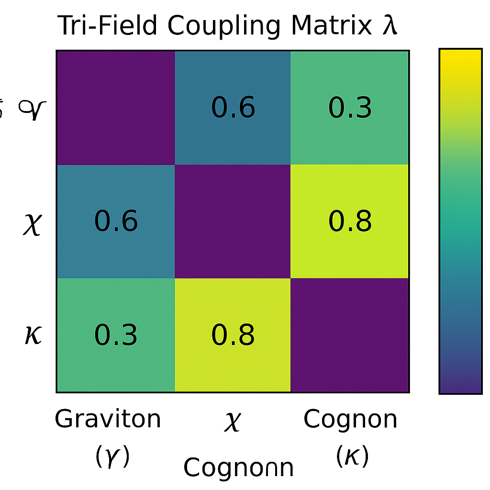
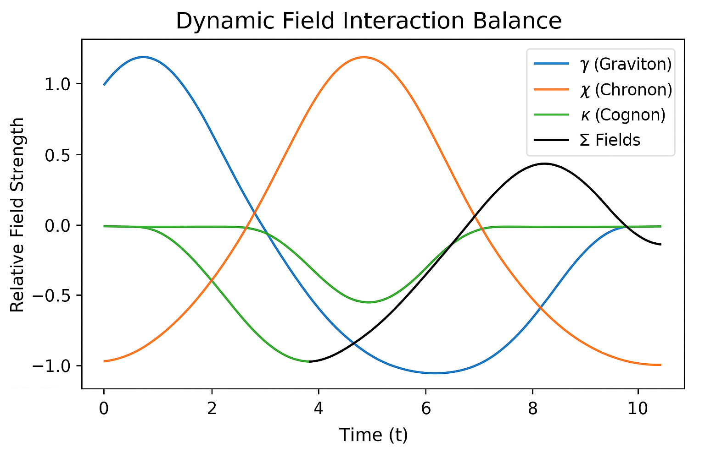
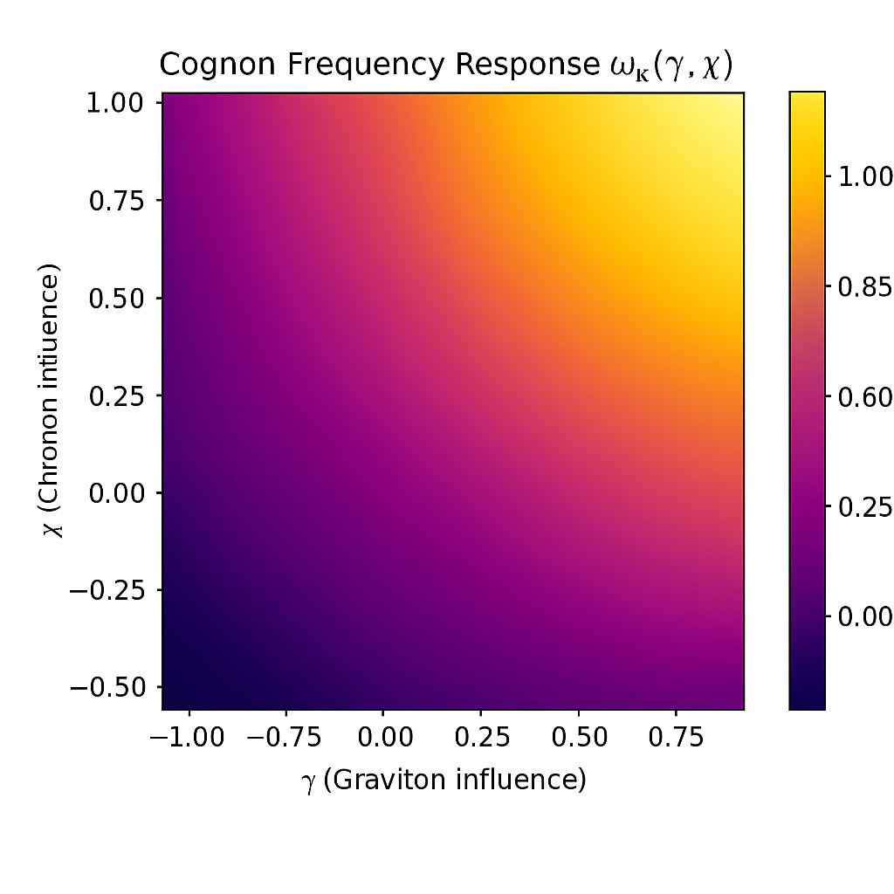
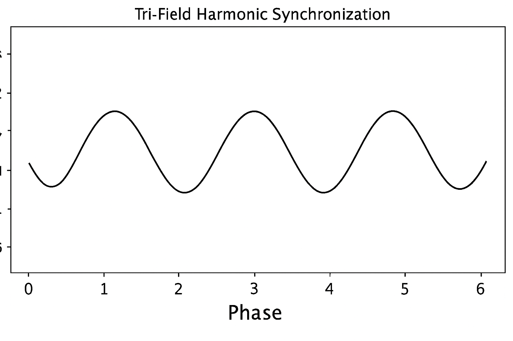
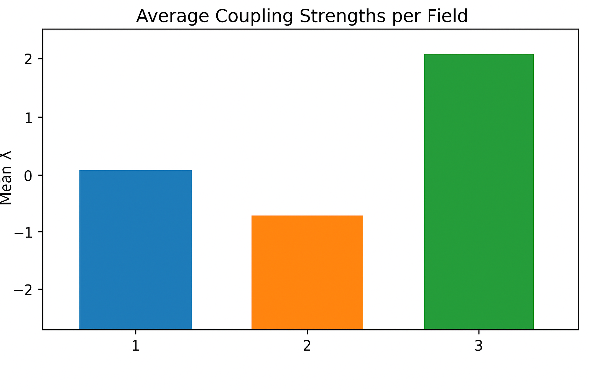

# Notebook 07 — Field Interactions

## Overview

Now that we’ve modeled **multi-particle coalescence**, we turn our attention to the **inter-field dynamics** — how the *graviton (γ)*, *chronon (χ)*, and *cognon (κ)* fields interweave to stabilize and transmit energy, time, and information within the Compressive Framework.

These three fields form the **tri-field symmetry**:

$begin:math:display$
(\\gamma, \\chi, \\kappa) \\Rightarrow (Gravity, Time, Information)
$end:math:display$

They interact through a **compression-exchange equilibrium**, sustaining the coherence of all matter and waveforms.

---

## 1. Tri-Field Coupling Model

We define the interaction energy density as:

$begin:math:display$
\\mathcal{E}_{\\text{int}} = \\lambda_{\\gamma\\chi} \\gamma\\chi + \\lambda_{\\chi\\kappa} \\chi\\kappa + \\lambda_{\\kappa\\gamma} \\kappa\\gamma
$end:math:display$

where λ terms represent coupling strengths between respective fields.

⸻

2. Interaction Balance

When the system reaches field equilibrium, total energy exchange satisfies:

\sum_i \frac{dE_i}{dt} = 0

Each field dynamically adjusts to conserve the unified energy distribution.

⸻

3. Information Compression & Resonance

The cognon field (κ) carries information through frequency alignment.
Its oscillation frequency modulates both time perception (via χ) and curvature (via γ):

\omega_\kappa = f(\chi, \gamma) = \alpha\chi + \beta\gamma

⸻

i4. Cross-Field Synchronization

Each field oscillates, but coherence only occurs when all three align in harmonic proportion:

n_\gamma : n_\chi : n_\kappa = p : q : r

This generates stabilized quantum nodes — points of minimal entropy and maximal coherence.

⸻

5. Summary of Roles

Field | Symbol | Function | Observable Effect
---------------------------------------

Graviton -> γ -> Curvature + Energy regulation -> Spacetime stability

Chronon -> χ -> Temporal regulation -> Phase coherence -> 

Cognon -> κ -> Informational resonance -> Data preservation & transmission

⸻

6. Conceptual Integration

When γ, χ, and κ synchronize, they create compression singularities — self-stabilizing nodes that hold mass-energy, time continuity, and informational coherence together.

Matter exists where gravity, time, and information compress in harmony.

⸻

7. Visualization Summary

⸻

8. Closing Note

The Tri-Field Interaction System represents the deep symmetry of the Compressive Framework — where information flow (κ), temporal continuity (χ), and curvature stability (γ) merge into a single self-regulating dynamic.

⸻

Next Notebook → Quantized Curvature

