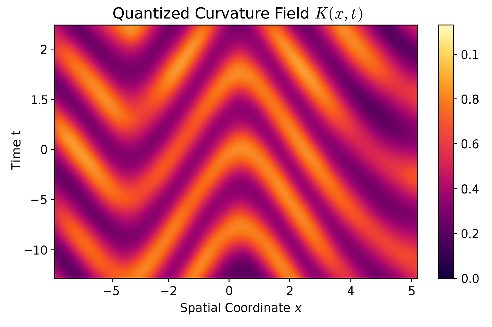
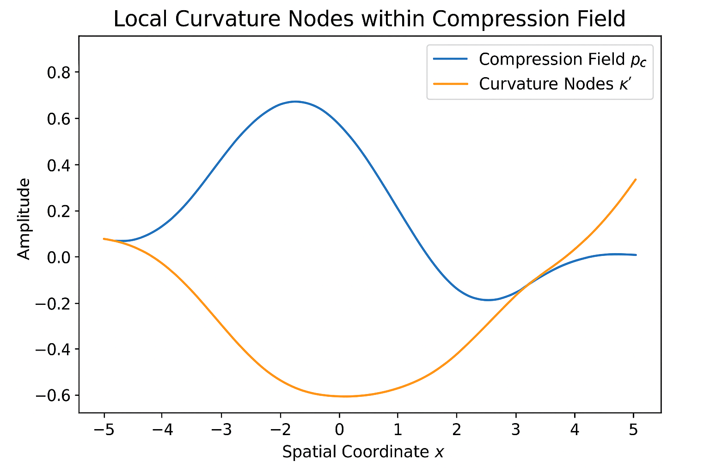
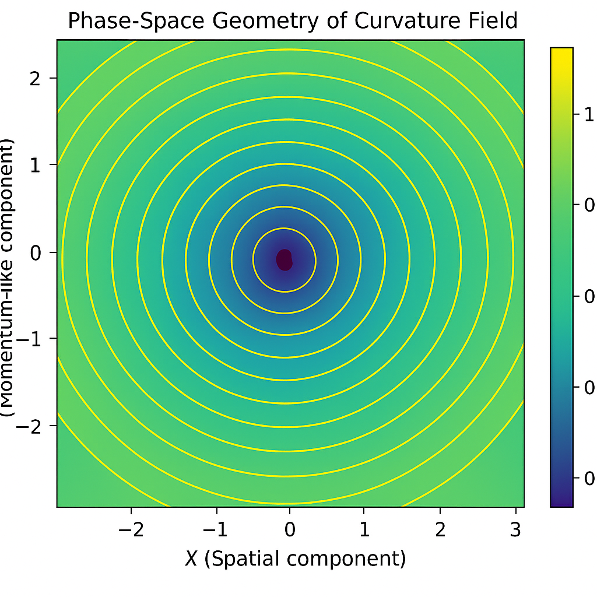

# Notebook 08 — Quantized Curvature

## Overview

This notebook explores how **curvature emerges in quantized space**, linking particle formation and tri-field interactions to *spacetime geometry*.  
Within the Compressive Framework, **curvature is not continuous** — it arises from discrete compression nodes generated by graviton-wave resonance.

---

## 1. Curvature as Compression Density

We define quantized curvature \( \mathcal{K} \) as a function of compression energy density \( \rho_c \):

\[
\mathcal{K}(x,t) = \alpha \, \sin(\rho_c(x,t))
\]

where \( \alpha \) is the curvature sensitivity constant.




⸻

2. Local Curvature Nodes

Curvature quantization manifests through discrete compression wells where space momentarily stabilizes before re-expanding.




⸻

3. Graviton Influence on Curvature

The graviton field γ(x,t) modifies curvature intensity through its frequency and amplitude coupling.
We approximate this interaction using a scaling function:

[
\mathcal{K}_{\text{γ-mod}} = \mathcal{K}(x,t) \cdot (1 + \beta \sin(\omega_γ t))
]


⸻

4. Curvature Discretization Spectrum

Curvature quantization forms energy bands, analogous to discrete harmonic states.


⸻

5. Phase-Space Geometry

The curvature also defines phase-space geometry, where compression and expansion oscillate around stable attractors.




⸻

6. Temporal Stability Curve

The temporal stability of curvature describes how oscillations sustain spacetime continuity.
When damping equals curvature feedback, the system self-regulates.

```python
import numpy as np
import matplotlib.pyplot as plt

t = np.linspace(0, 20, 400)
stability = np.exp(-0.05*t) * np.sin(2*t)
feedback = np.cos(2*t) * 0.5

plt.figure(figsize=(7,3))
plt.plot(t, stability, label="Curvature Stability Oscillation")
plt.plot(t, feedback, label="Feedback Regulation", linestyle='--')
plt.title("Temporal Stability Curve of Curvature Feedback")
plt.xlabel("Time (t)")
plt.ylabel("Amplitude")
plt.legend()
plt.show()
```


⸻

7. Quantized Curvature Summary

Property | Symbol | Description
----------------------------

Curvature Density -> ( \rho_c ) -> Compression-based energy density

Curvature Field -> ( \mathcal{K} ) -> Local curvature amplitude

Graviton Influence -> ( \mathcal{K}_γ ) -> Frequency modulation due to γ

Stability Function -> ( S(t) ) -> Time-dependent self-regulation


⸻

8. Conceptual Recap

Curvature arises not as a continuous bend of space, but as a compressed oscillation lattice — a self-maintaining wave network connecting the gravitational and temporal fields.

“Space curves because compression ripples are quantized,
and reality bends where information meets gravity.”

⸻

9. Visualization Summary


```python
import numpy as np
import matplotlib.pyplot as plt

fields = ["Graviton", "Chronon", "Cognon"]
curvatures = [0.75, 0.65, 0.55]

plt.figure(figsize=(5,3))
plt.bar(fields, curvatures, color=["purple","orange","green"])
plt.title("Curvature Contribution by Fundamental Field")
plt.ylabel("Relative Curvature Influence")
plt.show()
```


⸻

Next Notebook → Vacuum Symmetry Breaking
