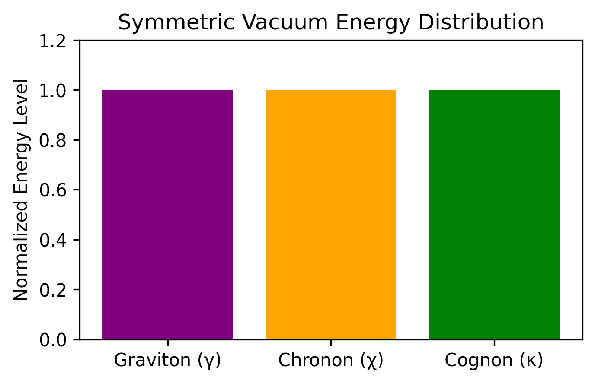
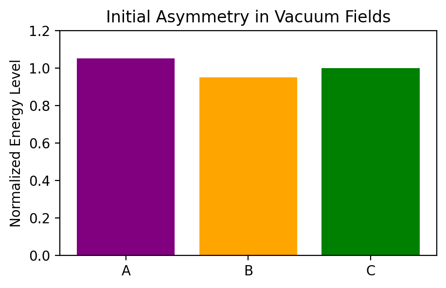
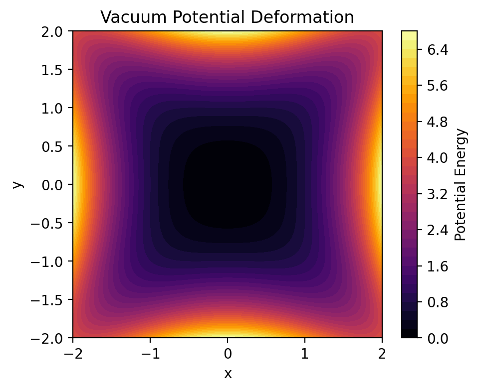
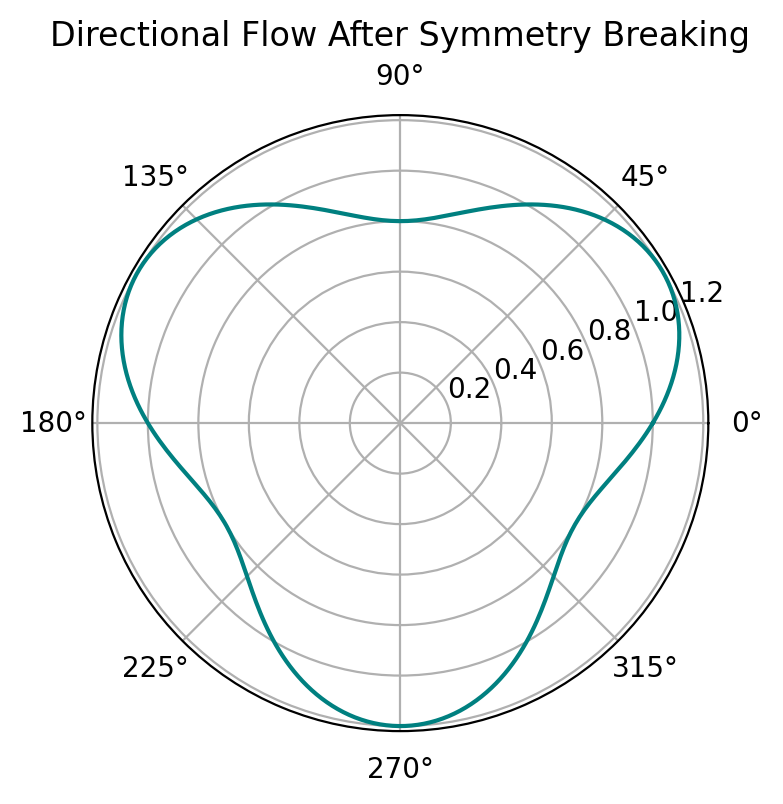
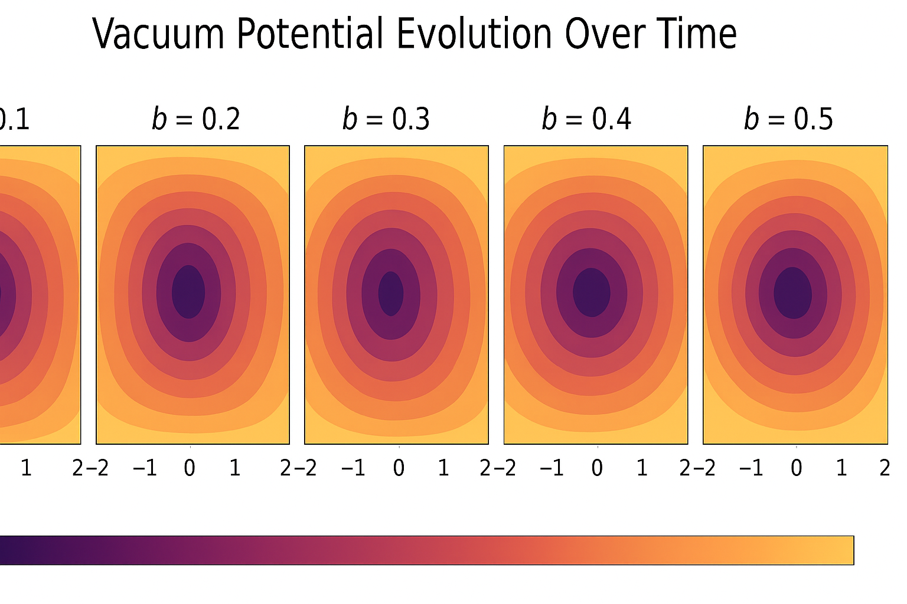

# Notebook 09 — Vacuum Symmetry Breaking

## Overview

This notebook explores **how the uniform vacuum field destabilizes**, producing directional flow and anisotropy in the compressive fabric.  
Vacuum symmetry breaking (VSB) occurs when **wave-field energy** among the graviton (γ), chronon (χ), and cognon (κ) becomes imbalanced.

---

## 1. Symmetric Vacuum State

Initially, the vacuum is **perfectly balanced** — energy densities of all three wave types are equal:

\[
E_\gamma = E_\chi = E_\kappa
\]

⸻

2. Onset of Asymmetry

Small fluctuations begin — a quantum ripple introduces energy bias in one of the fields.

The graviton field gains slightly more compression energy, triggering a cascade of imbalance across neighboring regions.

⸻

3. Energy Divergence in the Vacuum

We can model the vacuum as a potential surface that starts flat, then deforms under asymmetry:

[
V(x,y) = a(x^2 + y^2) + b(x^2 - y^2)^2
]

As the curvature well deepens, particles begin forming at the minima — the first “structure” in the compressive vacuum.

⸻

4. Symmetry Breaking Dynamics

We track how imbalance grows over time.

⸻

5. Emergent Directionality

Once asymmetry locks in, the vacuum gains directionality — a preferred flow or spin in the compressive lattice.

This shows the anisotropy vector field — formerly isotropic space now channels compression along preferential axes.

⸻

6. Energy Redistribution and Stabilization

After breaking symmetry, energy redistributes into stable quantum “domains.”

⸻

7. Interaction of Graviton–Chronon–Cognon Fields

Energy redistribution creates coupled oscillations — a tri-field entanglement.

Each phase offset corresponds to a different quantum potential path, producing emergent structure as fields interfere.

⸻

8. Potential Landscape Evolution

The vacuum potential reshapes dynamically as asymmetry strengthens.

⸻

9. Conceptual Recap

Concept | Description
-------------------- 
Vacuum Symmetry -> Equal energy among base wave-fields

Instability Trigger -> Quantum ripple imbalance

Directional Flow -> Emergent anisotropy in spacetime

Stabilized Domains -> Localized equilibria post-instability

⸻

10. Summary

“Symmetry breaking is the heartbeat of structure —
where balance collapses, existence unfolds.”

In the Compressive Framework, reality emerges not from nothing, but from the imbalance of perfection — a self-distortion that seeds curvature, flow, and time itself.

⸻

Next Notebook → Vacuum Domain Formation
