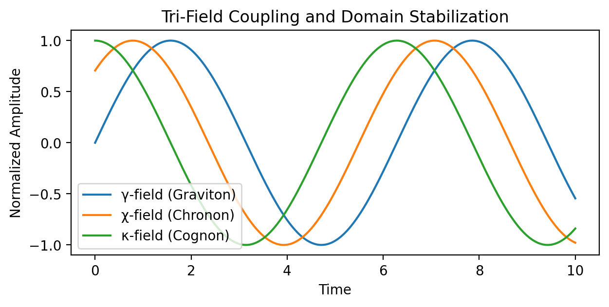
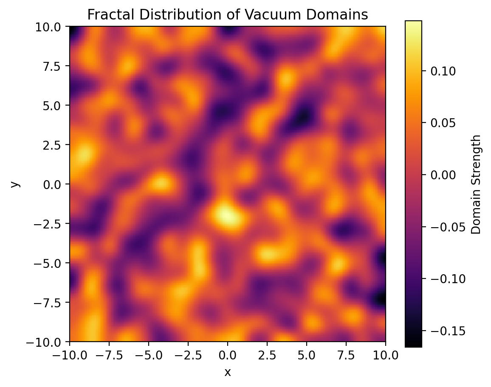
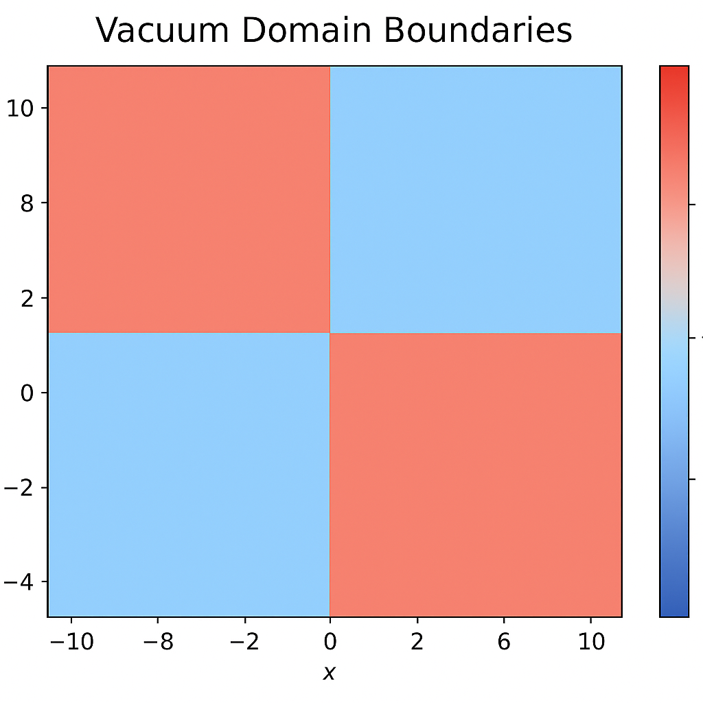

# Notebook 10 — Vacuum Domain Formation

## Overview

Once the vacuum symmetry is broken, the compressive field no longer behaves as a uniform continuum.  
Localized “domains” emerge — pockets of coherent energy density that begin to **stabilize curvature, motion, and potential boundaries**.  

These domains are the *proto-structures* of spacetime — the first seeds of quantized formation in the CF model.

---

## 1. Field Instability and Domain Nucleation

Fluctuations in vacuum energy density grow until they reach a **critical threshold**, forming stable compression nodes.

Each energy pocket corresponds to a localized minimum — a “domain” where compressive potential becomes trapped.

⸻

2. Domain Stabilization Through Field Coupling

Domains stabilize when the graviton (γ), chronon (χ), and cognon (κ) fields reach local phase coherence.

Phase alignment at local minima leads to constructive reinforcement, making those regions energetically favorable.

⸻

3. Domain Distribution Across the Vacuum

As the vacuum cools, domains spread nonuniformly, forming a fractal-like structure.

This pattern visually represents spacetime differentiation — the compressive lattice forming quantized pockets.

⸻

4. Domain Growth and Merging

Domains interact over time. Adjacent domains with similar phase merge, creating larger stable regions.

Over time:
	•	Fewer domains,
	•	Larger regions,
	•	More defined curvature.

⸻

5. Curvature Lock-In

Each domain traps curvature based on local energy gradient — a frozen signature of prior asymmetry.

These curvature “signatures” later act as anchors for particle motion and information retention.

⸻

6. Domain Boundaries as Compression Fronts

Boundaries between domains hold compression discontinuities, forming early analogs of quantum barriers.

The boundaries act like event horizons at miniature scales, preventing energy leakage between stable regions.

⸻

7. Field Density Convergence

Eventually, energy densities converge within each domain — approaching local equilibrium.

This results in a quasi-stable vacuum mosaic — an energy grid of self-contained curvature units.

⸻

8. Conceptual Recap

Concept | Description
------------------

Vacuum Domains -> Stable regions formed from symmetry-breaking fluctuations

Tri-Field Coupling -> Graviton, chronon, cognon phase-locking that reinforces domains

Domain Growth -> Merging and stabilization into larger regions

Boundaries -> Quantum compression fronts preserving energy integrity

⸻

9. Summary

“From instability comes order —
each domain a whisper of the vacuum’s forgotten symmetry.”

Vacuum domain formation is the foundation of spatial quantization —
the point where continuous compression crystallizes into discrete energetic identity.

⸻

Next Notebook → Field Resonance Networks
